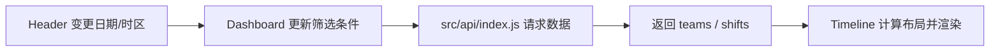

# Support Roster UI 前端架构

## 文档定位

本文件描述 `support-roster-ui` 的运行时结构、入口分流、分层职责、状态策略与后端集成方式。它只覆盖前端边界，不展开后端内部实现与 Excel 解析细节。

## 应用总览

```mermaid
graph TB
    APP[Vue App]
    ROUTER[Vue Router]
    VIEWER[/viewer Public Viewer]
    CONTACT[/contact-information Public Contact Directory]
    WORKSPACE[/workspace Admin Workspace]
    PAGE1[PublicDashboardPage.vue]
    PAGEC[ContactInformationLayout + RouterView]
    PAGE2[WorkspaceLayout + RouterView]
    DASH[Dashboard.vue]
    API[src/api/index.js]
    SERVER[support-roster-server REST APIs]

    APP --> ROUTER
    ROUTER --> VIEWER
    ROUTER --> CONTACT
    ROUTER --> WORKSPACE
    VIEWER --> PAGE1
    CONTACT --> PAGEC
    PAGE1 --> DASH
    DASH --> API
    PAGE2 --> API
    API --> SERVER
```

## 顶层路由分流

| 路由 | 作用 | 入口组件 | 说明 |
|------|------|----------|------|
| `/` | 默认入口 | redirect | 统一重定向到 `/workspace` |
| `/viewer` | 公共排班看板 | `src/pages/PublicDashboardPage.vue` | 只读、展示优先 |
| `/contact-information` | 支持团队联系信息页 | `src/features/contact-information/layout/ContactInformationLayout.vue` | 公开访问、独立全屏、当前使用 mock 数据 |
| `/workspace` | 管理工作台 | `src/features/workspace/layout/WorkspaceLayout.vue` | 编辑、校验、导入导出优先 |

## 运行时分层

| 层级 | 目录 | 职责 |
|------|------|------|
| 应用入口层 | `App.vue`、`main.js` | 挂载应用与路由 |
| 页面层 | `src/pages/`、`src/features/contact-information/pages/`、`src/features/workspace/pages/` | 组织页面状态与交互流程 |
| 组件层 | `src/components/`、`src/features/contact-information/components/`、`src/features/workspace/components/` | 渲染结构、承载局部交互 |
| 请求层 | `src/api/index.js` | 对后端 REST 接口做统一封装 |
| 工具层 | `src/lib/`、`src/features/contact-information/lib/`、`src/features/workspace/lib/` | 纯函数、时间与格式化辅助 |

## 产品域职责

### Public Viewer

- 面向 `/viewer`，强调只读浏览与清晰展示。
- 主要模块为 `Dashboard.vue`、`Header.vue`、`Timeline.vue`。
- 页面状态以本地容器状态为主，不依赖全局 store。
- 通过 `src/api/index.js` 拉取团队与班次数据。

### Admin Workspace

- 面向 `/workspace`，强调编辑、管理、校验与导入导出流程。
- 采用共享壳层 + 子页面的结构组织业务。
- 月度上下文由 workspace 侧共享状态维护，供多个页面复用。
- 详细实现继续拆分在 `workspace/` 分册中维护。

### Public Contact Directory

- 面向 `/contact-information`，强调快速查阅支持团队联系信息与基础录入演示。
- 采用独立布局，不复用 `WorkspaceLayout`。
- 当前数据来源为本地 mock，便于先稳定 Figma 转 Vue 的结构与交互。

## 数据流

### Viewer 数据流



### Workspace 数据流

Workspace 的页面级数据流、共享月度状态与页面协作方式，统一收敛到 `workspace/architecture.md` 与具体页面 spec，不在根级重复展开。

## 状态管理策略

- Viewer 以页面局部状态为主，状态简单且作用域清晰。
- Workspace 将跨页面的年月上下文沉淀为共享状态，其余编辑态优先留在页面或 composable 内部。
- 当前无登录态、无 RBAC、无前端权限裁剪逻辑。
- `src/stores/` 不是主流程依赖，不应在 spec 中假设其承载核心状态。

## 后端集成边界

- 前端仅依赖 REST 接口契约，不依赖后端内部类或数据库结构。
- Viewer 使用只读接口；Workspace 使用 `/api/workspace/**` 管理接口。
- 当前没有 websocket 或 SSE，数据刷新依赖显式重新请求。
- 任何接口路径、响应结构或精度约束变化，都必须同步回写相关 spec。

## 文档分流规则

- Viewer 组件职责、算法与渲染细节写入 `modules/`。
- Workspace 架构、路由、壳层、共享组件与页面说明写入 `workspace/`。
- 部署问题写入 `deployment.md`。
- 视觉、排版与组件观感写入 `ui-design.md` 与 `workspace/ui-design.md`。
