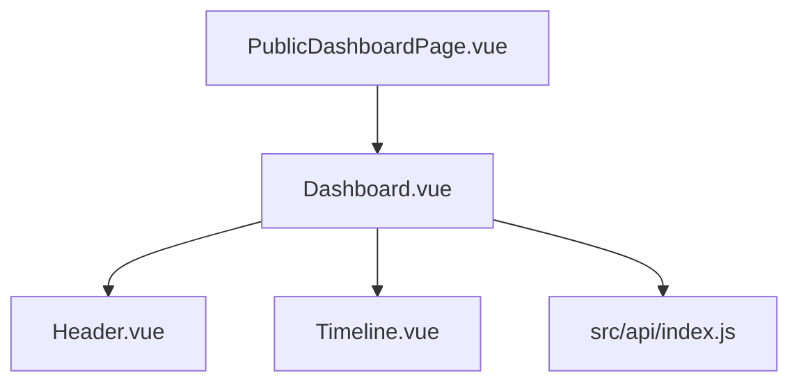

# Public Viewer 模块目录

## 模块范围

本目录覆盖 Public Viewer 的核心只读模块，用于说明看板页的结构、职责分工与模块协作关系，不展开 Admin Workspace 内容。

适用代码范围：

- `src/pages/PublicDashboardPage.vue`
- `src/components/Dashboard.vue`
- `src/components/Header.vue`
- `src/components/ExternalSystemsDrawer.vue`
- `src/components/Timeline.vue`
- `src/api/index.js`

## 推荐阅读顺序

1. 先读 `dashboard.md`，理解页面容器如何串联模块。
2. 再读 `header.md`，了解筛选、切换与触发事件。
3. 最后读 `timeline.md`，理解时间轴布局、泳道与渲染规则。

## 文档目录

| 文件 | 主题 | 说明 |
|------|------|------|
| `./dashboard.md` | 页面容器 | 串联 Header、Timeline、请求状态与只读页面行为 |
| `./header.md` | 顶部控件区 | 日期、时区、外部系统抽屉与页面级操作触发 |
| `./timeline.md` | 时间轴渲染 | 排班布局算法、泳道安排、tooltip 与样式逻辑 |

## 模块关系图

## 维护规则

- Viewer 页面入口、组件职责或数据流变化时，先更新本文件的目录与模块关系。
- 若新增 viewer 级独立组件并形成稳定职责，应在本目录新增对应 spec 并补回目录表。
- 过细的样式参数与视觉表达不应堆积在本文件，应写入具体模块页或 `../ui-design.md`。
