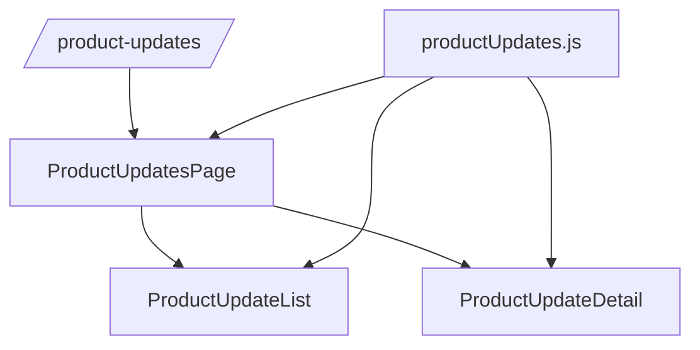

# 产品更新日志设计规格

## 页面定位

`/product-updates` 是独立的产品更新日志中心，用于沉淀支持排班系统的版本变化、重点更新、模块影响和历史修复记录。它不嵌入 `WorkspaceLayout`，也不复用 Public Viewer 的展示壳层，保证可以作为完整页面单独访问。

## 源码依赖

| 类型 | 路径 | 职责 |
|------|------|------|
| 路由入口 | `src/router/index.js` | 注册 `/product-updates` 顶层路由 |
| 页面容器 | `src/features/product-updates/pages/ProductUpdatesPage.vue` | 维护选中版本、当前版本状态、语言切换和独立页面布局 |
| 版本列表 | `src/features/product-updates/components/ProductUpdateList.vue` | 按月份展示当前语言的版本时间线，并向上抛出选择事件 |
| 版本详情 | `src/features/product-updates/components/ProductUpdateDetail.vue` | 展示当前语言的版本元信息、影响、重点更新、关联 PR 和分类条目 |
| 数据模型 | `src/features/product-updates/data/productUpdates.js` | 当前静态种子数据、中英文翻译、类型/模块字典、日期格式化与分组工具 |
| 国际化字典 | `src/i18n/locales/zh-CN.js`、`src/i18n/locales/en.js` | 页面固定文案、ARIA 文案与空态文案 |

## 信息架构

## 核心交互

- 页面顶部只保留轻量工具条：返回工作台、当前版本和 AI 随 PR 同步维护说明。
- 工具条提供中文 / 英文语言切换，复用全局 `setLocale()` 与本地存储。
- 页面不展示大标题、产品说明、概览卡片、筛选统计区或手工“新建日志”入口。
- 版本列表按发布月份分组，点击条目后在右侧显示详情。
- 当前版本显示在工具条中，格式为版本号、版本标题和发布日期。
- 详情页展示关联 PR 编号，编号必须可点击并跳转到 `https://github.com/yachi666/support-roster-ui/pull/{number}`。

## 数据模型

首版使用本地静态数据，内容由 AI 在相关 PR 中维护。条目结构必须保留以下字段，方便后续替换为 API：

- `id` / `version`：版本标识。
- `title` / `summary`：列表与详情页主文案。
- `date` / `status` / `importance`：发布时间、发布状态和重要程度。
- `type`：更新类型，当前包括 `feature`、`improvement`、`fix`、`permission`、`data`。
- `modules`：影响模块，当前包括 `roster`、`staff`、`team`、`permission`、`reporting`、`system`。
- `audience` / `impact`：适用对象和用户影响；当前页面不展示 `audience`，但保留数据字段以便后续做筛选或通知分发。
- `prNumbers`：用于说明该日志条目来自哪些 PR。
- `highlights`：重点更新短句。
- `sections`：按“新增功能 / 体验优化 / 问题修复 / 数据调整 / 权限调整”等分类展示的条目。

### 国际化要求

- 每条更新必须同时维护 `zh-CN` 与 `en` 两套文案。
- 类型、模块、状态、重要程度、影响说明、重点更新、分组标题和条目内容都必须可本地化；`audience` 数据如保留也必须同步双语。
- 日期和月份使用 `Intl.DateTimeFormat` 按当前语言格式化。
- 当新增 PR 日志时，不能只补中文或只补英文。
- 根据一组 PR 生成日志时，应优先按用户可理解的主题合并，而不是机械地每个 PR 一条日志。

## 视觉规范

- 页面保持后台产品气质：浅灰背景、白色内容面、深青色强调色、8px 以内圆角。
- 页面首屏应直接进入版本列表与详情阅读，不设置大面积 hero、概览卡片或筛选区。
- 主要内容采用左侧版本时间线 + 右侧详情面板的独立双栏布局，窄屏下改为单列。
- 小屏幕下必须提高信息密度：压缩工具条、隐藏非必要 AI 说明、减小列表项 padding、限制列表摘要行数，并降低详情页标题、卡片和分组间距。
- 移动端首屏应至少能看到当前版本和多条更新时间线内容，避免被大标题、大卡片或过宽留白占满。
- 13 寸笔记本等低高度桌面视口也应启用紧凑密度：减小双栏间距和侧栏宽度，隐藏详情页重复日期卡片，压缩详情页 H1、影响区、重点更新卡片和更新分组。
- 重点更新通过 `重点更新` 标签、影响面板和 highlight card 提升层级。
- 列表条目必须保留版本号、类型、标题、摘要、日期和模块，便于快速扫描。
- 图标按钮使用 `lucide-vue-next`，不使用文字替代熟悉符号。

## 后续接入边界

- 接 API 时优先替换 `productUpdates.js` 的数据来源，保留日期格式化和按月份分组语义。
- 创建或准备 PR 时，如果变更包含用户可见功能、页面、交互、权限、数据口径、部署入口或重要修复，必须同步维护 `productUpdates.js`。
- 更新 `productUpdates.js` 时必须同时补齐中文 `zh-CN` 与英文 `en`。
- 如果 PR 只是内部重构、测试补充或无用户可见影响，可以不新增产品更新日志，但 PR 描述应说明无用户可见更新。
- 若未来重新引入手工管理能力，应新增权限约束和编辑/发布流程 spec；当前页面不提供手工“新建日志”入口。
- 若订阅 RSS 或通知按钮接入真实功能，应补充接口路径、失败态和可访问性说明。
