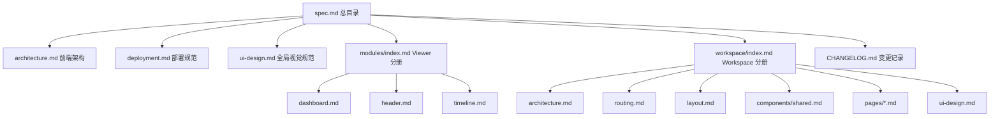

# Support Roster UI 规格总目录

## 文档定位

本目录是 `support-roster-ui` 的正式规格入口，用于沉淀 Public Viewer 与 Admin Workspace 两套前端体验的边界、结构、交互与视觉规范。整套文档按“总目录 -> 分册目录 -> 专题页”的方式组织，目标是让阅读路径更像一本可持续维护的技术手册。

## 推荐阅读顺序

1. 先读 `spec.md`，建立全局目录感。
2. 再读 `architecture.md`，理解应用分流、分层和数据流。
3. 若关注部署与上线边界，继续读 `deployment.md`。
4. 只读看板相关改动进入 `modules/index.md`。
5. 管理工作台相关改动进入 `workspace/index.md`。
6. 视觉与交互规范分别参考 `ui-design.md` 与 `workspace/ui-design.md`。

## 章节目录

| 章节 | 文件 | 说明 |
|------|------|------|
| 总览 | `./architecture.md` | 前端运行时结构、顶层路由、状态策略与后端集成边界 |
| 部署 | `./deployment.md` | 构建、容器化、Fargate 部署与发布约束 |
| 视觉 | `./ui-design.md` | 全局视觉语言与 Public Viewer 设计约束 |
| Viewer 分册 | `./modules/index.md` | Public Viewer 模块目录与模块关系 |
| Workspace 分册 | `./workspace/index.md` | Admin Workspace 的架构、路由、页面、组件与视觉规范 |
| 变更记录 | `./CHANGELOG.md` | 文档演进记录 |

## 文档架构图

## 文档边界

### Public Viewer

- 路由入口：`/viewer`
- 适用代码：`src/pages/PublicDashboardPage.vue`、`src/components/*`、`src/api/index.js`
- 关注点：模块职责、时间轴渲染、只读交互、展示型视觉规范

### Admin Workspace

- 路由入口：`/workspace`
- 适用代码：`src/features/workspace/*`、`src/router/index.js`
- 关注点：管理工作流、共享壳层、页面职责、抽屉式编辑、月度上下文同步

## 通用写作规则

- 文档统一以中文为主，保留必要英文术语、路径、组件名、接口名。
- 一级入口页负责“目录导航 + 阅读指引”，不承载过细实现细节。
- 详细规则写入对应专题页，避免根入口持续膨胀。
- 适合结构表达、关系说明或流程说明的内容优先使用 Mermaid，而不是静态图片。
- 页面、组件、接口、路径发生变化时，必须同步回写对应章节目录。

## 快速链接

- [前端架构](./architecture.md)
- [部署规范](./deployment.md)
- [视觉规范](./ui-design.md)
- [Public Viewer 分册](./modules/index.md)
- [Workspace 分册](./workspace/index.md)

