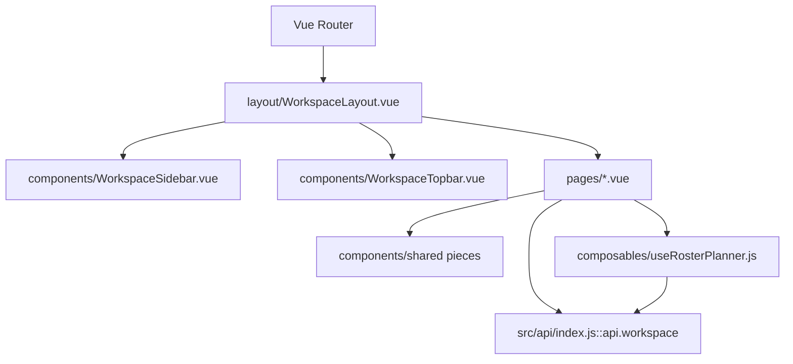

# Workspace 架构手册

## 文档定位

本文件描述 `src/features/workspace/` 的目录组织、壳层与页面分工、共享状态边界，以及它与根级路由和后端接口的集成方式。

## 代码根目录

```text
src/features/workspace/
├── components/
├── composables/
├── config/
├── layout/
├── lib/
└── pages/
```

## 结构关系图



## 分层职责

| 层级 | 目录/文件 | 职责 |
|------|-----------|------|
| 壳层层 | `layout/WorkspaceLayout.vue` | 提供稳定的 Sidebar / Topbar / RouterView 骨架 |
| 页面层 | `pages/*.vue` | 组织页面级请求、交互流程与局部视图结构 |
| 共享组件层 | `components/*.vue` | 提供 Drawer、Surface、Page Header、统计卡等复用 UI |
| 交互抽象层 | `composables/*.js` | 收敛复杂状态与可复用交互逻辑 |
| 配置层 | `config/navigation.js` | 维护导航元数据，避免和接口数据耦合 |
| 工具层 | `lib/*.js` | 处理年月、格式化与纯函数逻辑 |

## 关键设计决策

- `WorkspaceLayout.vue` 只负责壳层，不直接承载业务数据装配。
- 页面本身负责数据请求与页面内的状态协同，避免壳层过度膨胀。
- `api.workspace` 是统一的数据请求入口，页面不应绕开该层直接拼装 fetch 逻辑。
- 月度排班等高交互页面通过 composable 管理工作副本、保存请求与回滚行为。
- 侧边导航元数据独立维护，避免与后端返回结构耦合。

## 集成边界

- Workspace 不是独立部署单元，而是现有 SPA 的第二产品域。
- 根路径 `/` 默认重定向到 `/workspace`，因此管理端是默认落地页。
- Public Viewer 保留在 `/viewer`，与 Workspace 明确分流。
- Workspace 所有管理数据统一从 `/api/workspace/**` 获得，不使用本地 mock 数据兜底。

## 适合拆出单独 spec 的信号

当某个页面出现以下特征时，应考虑继续拆分子文档：

- 页面内部出现多个独立子流程。
- 单页拥有稳定复用的数据结构或复杂表格算法。
- 页面需要单独记录错误恢复、校验或批量操作约束。

## 维护规则

- 修改目录结构、共享状态来源或 composable 职责时，必须同步更新本文件。
- 若新增新的跨页面共享能力，应先评估放入 `components/`、`composables/` 还是 `lib/`，并在此登记。

