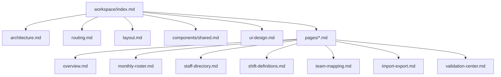

# Workspace Admin 规格目录

## 文档定位

本目录是 Admin Workspace 分册入口，负责把工作台的架构、路由、壳层、共享组件、页面规格与视觉规范组织成一套可连续阅读的章节目录。

## 推荐阅读顺序

1. `architecture.md`：先建立代码结构与状态边界。
2. `routing.md`：理解 `/workspace` 下的页面编排。
3. `layout.md`：理解共享壳层、Sidebar、Topbar 与月度上下文。
4. `components/shared.md`：了解可跨页面复用的通用组件。
5. `pages/*.md`：按业务页面阅读细节。
6. `ui-design.md`：最后确认管理端的专属视觉语言。

## 章节目录

| 章节 | 文件 | 说明 |
|------|------|------|
| 架构 | `./architecture.md` | 代码根目录、组件分层、共享状态与集成边界 |
| 路由 | `./routing.md` | `/workspace` 路由树、页面入口与导航约束 |
| 壳层 | `./layout.md` | Sidebar、Topbar、主内容区与共享年月状态 |
| 共享组件 | `./components/shared.md` | Header、Surface、Drawer、Stat Card 等复用件 |
| 页面：总览 | `./pages/overview.md` | 首页聚合看板与快捷入口 |
| 页面：月度排班 | `./pages/monthly-roster.md` | 排班矩阵、抽屉编辑、保存与回滚 |
| 页面：人员目录 | `./pages/staff-directory.md` | 列表、详情抽屉、增删改流程 |
| 页面：班次定义 | `./pages/shift-definitions.md` | 班次定义、共享团队、时间预览 |
| 页面：团队管理 | `./pages/team-mapping.md` | 团队顺序、可见性、分组映射 |
| 页面：导入导出 | `./pages/import-export.md` | Excel 预览、应用、导出、模板下载 |
| 页面：校验中心 | `./pages/validation-center.md` | 问题聚合、筛选、批量处理 |
| 视觉规范 | `./ui-design.md` | 管理端视觉语言与组件观感 |
| 认证与访问控制 | `./auth/index.md` | 登录页、会话、权限控制与账号管理页 |

## 信息架构图

## 实现约束

- Workspace 运行在现有 Vue 应用内，而不是独立第二个 Vite 工程。
- 路由、共享壳层与页面职责必须保持分层清晰，避免把所有状态回灌到根入口。
- 月度上下文是多个页面的共同基线，涉及年月切换的页面应统一对齐同一来源。
- 管理端页面优先强调编辑效率、表格扫描与错误反馈，而不是展示型大屏视觉。

## 维护规则

- 新增页面时，必须同步更新本目录表、路由图与侧边导航描述。
- 若共享组件演化为稳定公共能力，应优先补充到 `components/shared.md`。
- 若某页复杂度显著上升，可在 `pages/` 下继续拆分子专题，但必须在本文件登记。

