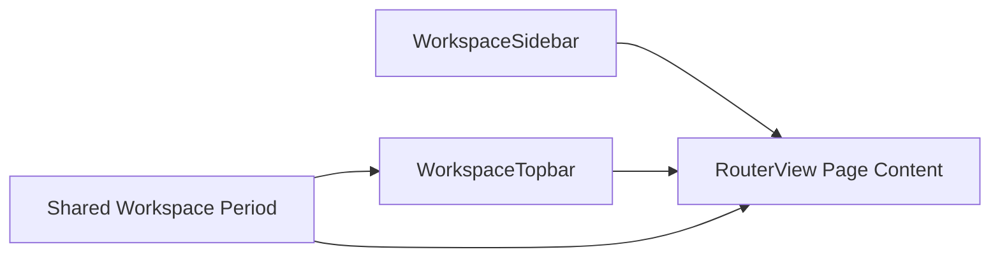

# Workspace 壳层布局

## 文档定位

本文件描述 `WorkspaceLayout.vue` 的壳层组成、Sidebar / Topbar / 主内容区的职责边界，以及共享年月上下文如何在页面间协同。

## 壳层结构图

## 区域职责

| 区域 | 主要职责 | 不负责的内容 |
|------|----------|--------------|
| `WorkspaceSidebar.vue` | 模块导航、当前路由高亮、校验徽标、账号摘要 | 页面业务数据请求 |
| `WorkspaceTopbar.vue` | 月份切换、全局辅助操作、跳转 Public Viewer | 具体页面表单状态 |
| `RouterView` | 承载各业务页面 | 共享导航骨架 |

## Sidebar 规则

- 导航项来源于 `config/navigation.js`，而不是页面内部硬编码。
- 当前路由高亮由 `useRoute()` 驱动。
- 校验相关徽标应与共享年月状态保持一致，避免显示滞后。
- 侧边栏底部信息属于壳层元素，不应与页面级操作混合。

## Topbar 规则
- Sidebar 底部账号信息必须来自当前登录态，而不是硬编码演示数据。
- Logout 属于壳层级操作，应放在 Sidebar 或 Topbar 的稳定位置。

- Topbar 持有共享月份切换入口，而不是各页面各自维护一套月份控件。
- 工作台采用月度工作流，因此 Topbar 不暴露日级日期选择器。
- `Open Public Viewer` 属于跨产品域跳转，应稳定保留。
- 搜索、通知、帮助等非主流程动作可为占位，但不能干扰核心工作流。

## 共享月份上下文

- `useWorkspacePeriod.js` 是月度上下文的单一来源。
- 月排班、校验中心、导入导出与侧边导航校验提示都应跟随同一 `year/month`。
- 切换月份时，页面应根据自身特性重取数据或重置本地工作副本。

## 视觉与交互要求

- 壳层需要保持稳定，避免页面内容滚动时破坏导航和工具区定位。
- 管理端采用更高的信息密度，优先保证扫描效率与操作效率。
- 壳层颜色、表面层级与抽屉行为统一遵循 `ui-design.md`。

## 维护规则

- 修改壳层组成、月份状态来源或导航职责时，必须同步更新本文件。
- 若新增全局工具区能力，应先评估其是否属于壳层，而不是某个页面的私有功能。

