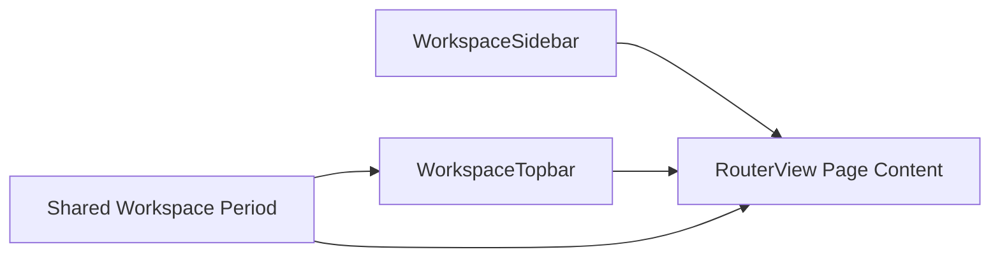

# Workspace 壳层布局

## 文档定位

本文件描述 `WorkspaceLayout.vue` 的壳层组成、Sidebar / Topbar / 主内容区的职责边界，以及共享年月上下文如何在页面间协同。

## 壳层结构图

## 区域职责

| 区域 | 主要职责 | 不负责的内容 |
|------|----------|--------------|
| `WorkspaceSidebar.vue` | 模块导航、当前路由高亮、校验徽标、账号摘要 | 页面业务数据请求 |
| `WorkspaceTopbar.vue` | 月份切换、路由级当前页面搜索、全局辅助操作、跳转 Public Viewer | 具体页面私有业务逻辑 |
| `RouterView` | 承载各业务页面 | 共享导航骨架 |

## Sidebar 规则

- 导航项来源于 `config/navigation.js`，而不是页面内部硬编码。
- 当前路由高亮由 `useRoute()` 驱动。
- 校验相关徽标应与共享年月状态保持一致，避免显示滞后。
- 侧边栏底部信息属于壳层元素，不应与页面级操作混合。

## Topbar 规则
- Sidebar 底部账号信息必须来自当前登录态，而不是硬编码演示数据。
- Logout 属于壳层级操作，应放在 Sidebar 或 Topbar 的稳定位置。

- Topbar 持有共享月份切换入口，而不是各页面各自维护一套月份控件。
- 工作台采用月度工作流，因此 Topbar 不暴露日级日期选择器。
- Topbar 搜索框是“当前页面搜索”的共享入口，搜索词按路由保存；同一路由下的页面主体、弹窗或预览组件可复用同一搜索词，而不是各自再维护一份孤立输入状态。
- 如果某页面在搜索态下存在排序/拖拽等高风险操作，应优先禁用该操作，而不是允许用户在过滤后的局部列表上执行全量重排。
- Topbar 应按 **搜索区 / 月份上下文区 / 跨域动作区** 三段组织，避免所有控件在同一水平层级里互相竞争。
- `Open Public Viewer` 属于跨产品域跳转，应稳定保留。
- `Linux Password Vault` 与 `Contact Information` 属于同类工具页入口，在 Topbar 中应作为同级次级按钮成组出现，而不是与主动作混成一排无层级的链接。
- Topbar 右侧跨域跳转按钮允许保留主次层级，但必须共享同一套尺寸骨架（高度、圆角、横向内边距、字重、垂直对齐），只通过颜色与边框区分主按钮和次按钮；长文案按钮还必须保持 `whitespace-nowrap` 与不收缩，避免在壳层顶栏中被挤压后溢出胶囊。
- 时间相关控件应优先围绕共享月份上下文组织；时区与语言作为辅助 meta control 内聚到时间模块中，而不是散落成与主切换等权的独立块。
- 当前 Topbar 采用 **单行工具栏 + 横向滚动兜底**：在较窄宽度下优先压缩搜索与时间控件，并通过 `overflow-x-auto` 保证右侧动作组始终可达，而不是先隐藏跨域动作。
- 当可用宽度继续下降时，跨域动作组允许先退化为 **icon-only** 形式，只要按钮本身仍可见、可点击，且主次层级仍能通过颜色与边框区分即可。
- 月份上下文区需要支持渐进压缩：月份摘要持续可见，月份/年份选择器变窄，时区与语言控件收缩为更紧凑的 meta control。
- 搜索不应是无效果的占位输入；若页面声明支持搜索，则必须作用到当前页面可见内容。

## 共享月份上下文

- `useWorkspacePeriod.js` 是月度上下文的单一来源。
- 月排班、校验中心、导入导出与侧边导航校验提示都应跟随同一 `year/month`。
- 切换月份时，页面应根据自身特性重取数据或重置本地工作副本。

## 视觉与交互要求

- 壳层需要保持稳定，避免页面内容滚动时破坏导航和工具区定位。
- 管理端采用更高的信息密度，优先保证扫描效率与操作效率。
- 壳层颜色、表面层级与抽屉行为统一遵循 `ui-design.md`。

## 维护规则

- 修改壳层组成、月份状态来源或导航职责时，必须同步更新本文件。
- 若新增全局工具区能力，应先评估其是否属于壳层，而不是某个页面的私有功能。
