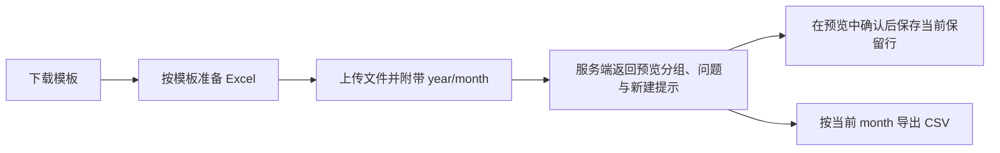

# Workspace 导入导出页

## 页面定位

导入导出页负责承接 Excel 模板下载、文件上传预览、问题校验、批次应用与 CSV 导出，是连接外部文件与内部月排班数据的工作流页面。页面应更像“导入前预检台”，先帮助管理员判断能不能应用，再让管理员执行应用动作。

## 源码与依赖

| 类型 | 位置 |
|------|------|
| 页面组件 | `src/features/workspace/pages/ImportExportCenterPage.vue` |
| 共享组件 | `WorkspacePageHeader.vue`、`WorkspaceSurface.vue` |
| 预览接口 | `POST /api/workspace/import-export/preview` |
| 保存接口 | `POST /api/workspace/import-export/save` |
| 导出接口 | `GET /api/workspace/import-export/export` |
| 模板接口 | `GET /api/workspace/import-export/template` |

## 核心流程

## 核心交互

- 空闲态支持点击上传与拖拽上传。
- 预览请求会附带共享 workspace 的 `year/month`。
- 成功态应展示预检结论、记录数、问题列表与应用操作入口。
- 导入预览弹窗中的员工搜索应复用 Workspace Topbar 的当前页面搜索词，避免同一路由内出现两份彼此不同步的搜索状态。
- 预览弹窗应支持按 team 删除本次导入分组；删除只影响当前预览与最终保存 payload，不删除系统里已有 team。
- 已删除的 team 应提供显式恢复入口，避免管理员误删后只能重新上传文件。
- 若预览发现问题，页面应给出下一步建议，例如进入 Validation Center 继续排查。
- `batchId`、文件名等长文本在卡片中必须可换行或自动压缩，不能因为大号数字或长文件名撑破布局。
- 同一月份再次执行预览时，新预览应替换旧的未保存预览状态，避免 `Import / Export` 与其他页面基于不同导入上下文操作。
- 导出直接消费服务端返回的二进制响应，服务端负责 UTF-8 BOM 与 charset 兼容。
- 切换共享月份后，需要重置当前预览状态，避免批次与工作上下文错位。

## 模板结构

| Sheet | 名称 | 说明 |
|------|------|------|
| 0 | `Shift Definitions` | 班次定义，支持单团队或逗号分隔的共享团队 |
| 1 | `Staff Shifts` | 员工日排班 |
| 2 | `Color Definitions` | 班次颜色映射 |

## 数据边界与约束

- 当前页面覆盖预览、保存、导出与模板下载，不提供浏览器内字段级映射修正。
- 导出结果由服务端定义，前端不应在浏览器侧拼接 CSV 内容。
- 前端可基于 `validRecords`、`invalidRecords` 与预览 `issues` 做本地二次编排（例如预检结论、问题摘要、优先问题卡），但不应伪造新的导入结果字段。
- 预览里的 team 删除属于前端工作副本能力，保存时仅提交仍保留的 `rows`；未保留的 team/staff 不应出现在最终保存 payload 中。

## 维护提示

- 若未来增加导入问题修复、字段映射编辑或批量回滚，应拆出专门章节。
- 模板格式、上传参数或响应结构变化时，必须同步更新本页与服务端 `import-export` spec。
