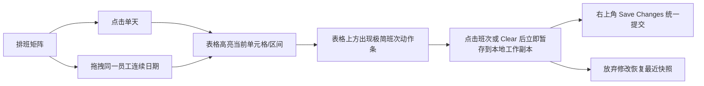

# Workspace 月度排班页：极简编辑改版设计

## 文档定位

本文档描述月度排班页从“右侧抽屉编辑”过渡到“表格内选区 + 顶部极简动作条”的交互改版方案，重点收敛编辑重量、减少重复信息提示，并保持点击单天与拖拽区间两种操作路径的一致性。

## 目标与非目标

### 目标

- 移除当前默认依赖的右侧抽屉，避免编辑动作打断表格扫描。
- 不再为已可见的选区重复展示 staff、日期、区间文字提示。
- 单天点击与同一员工行内拖拽区间共享同一套编辑模型。
- 班次按钮点击后立即写入本地工作副本，用户只在右上角统一执行 `Save Changes`。
- 顶部编辑区只承载“班次选择 / Clear”动作，不承载额外说明、复用建议或快捷复制。

### 非目标

- 本次不保留抽屉中的快捷复用、复制本周到下周、当前/待应用对比等高阶编辑辅助。
- 本次不引入新的批量编辑入口，也不扩展到跨员工多行选择。
- 本次不改变保存接口、增量载荷结构与未保存修改的核心数据模型。

## 交互总览

## 核心设计决策

### 1. 移除右侧抽屉

- 点击单元格或拖拽区间后，不再打开 `AssignmentDrawer`，也不使用贴边浮层。
- 页面保持矩阵优先，编辑动作尽量贴近表格，但不覆盖表格主体内容。
- 抽屉承载的多数说明型内容视为冗余，改版后不再迁移到新位置。

### 2. 使用极简动作条替代状态条与抽屉主体

- 在表格上方、月份标题下方保留一条轻量动作带，仅在存在有效选区时展示。
- 动作带只包含当前可选班次按钮和 `Clear` 按钮。
- 动作带不再显示“Selected Alice”“May 12 - May 14”或类似上下文说明，因为这些信息已由表格选区本身表达。
- 未保存修改数量不再通过独立状态条提示，只收敛到右上角 `Save Changes` 按钮文案或徽标中。

### 3. 选区自己表达上下文

- 单天点击时，当前格保持最高优先级高亮。
- 拖拽区间时，连续区间保持清晰的填充高亮，起点格仍有更强锚点样式。
- 同一员工行可继续使用较弱的整行辅助高亮，但不得抢过当前单元格与区间状态。
- 因为用户已经直接在矩阵中看到选中了什么，新动作带不再重复解释。

### 4. 点班次即暂存

- 用户点击任一班次按钮或 `Clear` 后，立即把当前单元格或当前拖拽区间写入本地工作副本。
- 写入完成后，选区仍可保留，便于连续改动；不要求每次写入后自动清空选区。
- 真正的持久化仍通过现有 `Save Changes` 触发，保持“本地暂存 -> 统一提交”的工作流不变。

## 页面结构调整

## 顶部区域

- 保留月份标题、搜索、团队筛选、导入导出、复制上月、`Save Changes` 等高层操作。
- 移除当前承载未保存数量、筛选摘要、键盘提示、区间提示的厚状态条设计。
- `Save Changes` 继续作为唯一主提交动作；若存在待保存修改，可在按钮内展示数量。

## 编辑动作带

- 放置在表格上缘，与矩阵形成直接上下关系。
- 默认隐藏；只有存在单元格选中或有效拖拽区间时才显示。
- 内容只包括：
  - 班次编码按钮列表
  - `Clear` 按钮
- 若当前用户对选中 team 只读，则动作带可以保持可见但全部禁用，或直接不显示可点击按钮；具体实现需与现有权限表现保持一致。

## 表格主体

- 继续保留点击选中、方向键移动、同一员工行拖拽连续日期、未保存改动标记、tooltip 懒挂载等既有能力。
- 视觉层级继续遵循：当前单元格 > 区间选择 > 待保存改动 > 员工行定位 > hover。
- 改版后，表格需要承担更多上下文表达职责，因此当前选中和区间样式必须足够清晰，不能依赖额外文字提示兜底。

## 组件边界建议

### `MonthlyRosterPlannerPage.vue`

- 负责页面级布局、顶部操作、保存/放弃工作流与选区状态协调。
- 不再负责控制右侧抽屉开合。
- 负责把当前选区和可用班次传递给新的极简动作条组件。

### 新增建议组件：`RosterSelectionActionBar.vue`

- 单一职责：在有选区时渲染极简班次动作按钮，并把点击事件向上抛出。
- Props 建议：
  - `visible`
  - `readonly`
  - `shiftCodeOptions`
- Emits 建议：
  - `select-code`
- 该组件不接收也不展示 staff 名称、日期、区间摘要。

### `RosterGrid.vue`

- 保留单元格选中、拖拽区间、键盘导航等热路径交互。
- 继续向页面抛出“当前选中了什么”，但不负责渲染顶部动作条。
- 若抽屉彻底退出，可删除与 `open-selected-cell`、抽屉打开语义强耦合的事件与状态，改为统一的“更新当前选区”模型。

## 数据流与状态约束

- `selectedCell` 与 `selectedRange` 继续作为当前编辑上下文来源。
- “当前待应用班次”不再需要抽屉态单独维护；用户点击班次按钮时可直接复用现有写入工作副本逻辑。
- 若当前为单天选中，则只更新一个格子；若当前为同一员工的拖拽区间，则对整个区间批量写入相同班次。
- `pendingUpdateKeySet`、`pendingUpdateCount`、保存与放弃逻辑沿用现有模型，避免改动接口层。

## 错误处理与权限

- 只读 team 不允许通过动作带写入变更。
- 保存失败、导入导出错误等页面级消息仍保留，但不再依赖厚状态条承载。
- 当没有选区时，动作带不出现，避免用户误以为当前会作用到未知对象。
- 当选区因筛选变化、月份切换或放弃修改失效时，动作带应立即消失。

## 测试与验证关注点

- 点击单天后不再打开抽屉，而是显示极简动作带。
- 拖拽同一员工连续日期后，动作带可对整个区间生效。
- 动作带不展示 staff 名称、日期、区间文案。
- 点击班次按钮后立即产生未保存改动标记，`Save Changes` 数量同步变化。
- 只读用户或只读 team 下，动作带不会产生可提交写入。
- 切换月份、离开页面、放弃修改等路径继续正确处理未保存变更确认。

## 与现有规格的关系

- 现有 `monthly-roster.md` 中关于“右侧抽屉作为主编辑容器”的描述，在正式实现本方案时需要回写更新。
- 本文档作为改版设计规格，先定义目标交互；具体落地后，再把稳定状态合并回页面主规格。
